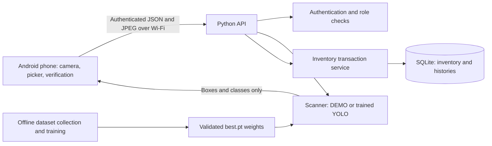

# MOVIS system design

The user clarified the workflow: still-photo recognition, editable quantities, optional ADDITIVE stock entry, and separate manual TOTAL correction. PHOTO-WORKFLOW.md is authoritative for these updated flows. The original reconciliation design below describes the retained compatibility endpoint.

## Source requirements and assumptions

The primary source is `CAPSTONEmovis.docx`, especially Chapter 1: rationale, IPO framework, objectives, problem statement, scope, and limitations. Its later chapters largely contain writing guidance and sample references, not evidence of completed development or evaluation. The duplicate chapter number for Results and Discussion is a document issue, not a software requirement. Example bibliography entries are not cited as warehouse research in this project.

Document requirements implemented: smartphone photographs, multi-object YOLO detection, user verification, inventory records and locations, authorized access, automatic difference calculation after verification, adjustment history, return status records, inventory reports, and evaluation planning. The document excludes continuous whole-warehouse surveillance, robotics, drones, and automatic approval.

User additions implemented: native Android client, confidence/box display, correction of verified counts, explicit full-location confirmation, idempotency, safe concurrent writes, and duplicate-restock prevention. The user does not yet have actual item classes or a training dataset and intends to train later.

Proposed design choices: Java native Android, Python HTTP API, SQLite, server-side YOLO, administrator/operator/viewer roles, initial demo items, status transitions, exact model-label mappings, zero-stock initialization, eight-hour sessions, and a local Wi-Fi server. These are implementation choices, not claims taken from the capstone.

## Technology stack

| Component | Choice | Reason |
|---|---|---|
| Phone | Native Android, Java 17, SDK 35, minimum API 26 | Direct access to Android camera/picker and simple screens with few dependencies |
| Backend | Python 3.11+, standard-library HTTP server | Small inspectable capstone service; easy transition to a production API framework |
| Database | SQLite, foreign keys, serialized write transactions | Single-warehouse persistence without a separate database installation |
| Image processing | Pillow | Validate images, normalize orientation, convert to RGB |
| Detection | Optional Ultralytics YOLO | Real trained-model inference with normalized boxes and confidence |
| Testing | Python unittest | Reproducible tests of stock correctness, permissions, and retries |

The development server is appropriate for a supervised local demonstration. Larger deployments need a production server, HTTPS, operational monitoring, migration management, and backup/restore procedures. The actual trained model must be benchmarked before selecting server hardware.

## Architecture



Camera photographs are processed in memory and are not retained by the backend. Scan results, snapshot quantities, timestamps, and users are retained. The Android camera's temporary image is in app cache. Training photos must be collected and retained separately with permission; application scans are not automatically added to a dataset.

## Database design

| Table | Purpose and relationships |
|---|---|
| users | Unique username, salted password hash, role |
| sessions | Random bearer token, user foreign key, expiry |
| items | Unique SKU, display name, unique YOLO model class |
| locations | Unique shelf/bin name |
| stock | Composite key `(item_id, location_id)`, nonnegative quantity, version |
| scans | UUID, operator, location, mode, detections, stock/version snapshot, timestamp |
| adjustments | Scan/item/location, prior quantity, verified quantity, signed difference, reason, actor, timestamp, unique request key |
| returns | Item/location, positive quantity, reason, status, actor, timestamp, unique request key |
| return_events | Every status transition with prior/new status, actor, timestamp |
| movements | Signed inventory effect, resulting quantity, source adjustment/return, actor, timestamp |

Items and locations form a many-to-many relationship through stock. Users have many scans, adjustments, returns, and events. Each return has many status events and at most one restock movement. Each scan may have one adjustment per item/location. SQLite unique constraints enforce these rules. A zero difference is still a verified reconciliation record.

## Roles and screens

| Role | Inventory and reports | Scan / confirm adjustments | Record, inspect, restock returns | Catalog and accounts |
|---|---|---|---|---|
| Administrator | Yes | Yes | Yes | Yes |
| Operator | Yes | Yes | Yes | No |
| Viewer | Yes | No | No | No |

The server checks permissions independently of Android buttons. Segregating inspection and restock permission into a supervisor role is a possible future warehouse policy, not implemented in this version.

Screens: sign-in with configurable server URL; inventory by item/location; photo scanning with bounding boxes; verified-count and confirmation form; return registration and status controls; reports/history with CSV sharing; administrator catalog, stock registration, and account setup.

## Algorithms

### Scan and verify

```text
Authorize operator
Validate selected location and uploaded image size/format
Read quantities and versions for registered stock at that location
IF mode is DEMO:
    Generate labeled synthetic boxes; never inspect image content
ELSE:
    Run configured trained YOLO weights
    Map each detected class to catalog item, or mark it unmapped
Store detections and quantity/version snapshot as a scan record
Return boxes, confidence, mode, and warning
User reviews classes, observes missed/hidden units, and supplies verified totals
No inventory update occurs at this stage
```

### Confirmed stock reconciliation

```text
Authorize operator
Require explicit confirmation AND full item/location count acknowledgement
Validate scan ownership, location, item, nonnegative count, reason, request key
BEGIN serialized write transaction
If request key already exists:
    Return existing result only if payload and actor match; otherwise reject
Reject if this scan/item/location already has a committed adjustment
Reject if current stock version differs from scan snapshot
difference = verified_quantity - previous_quantity
Set stock quantity = verified_quantity; increment version
Insert adjustment and movement with user and timestamp
COMMIT everything together
```

The acknowledgement requires a human to count outside the photograph. Software cannot prove that every unit is visible. Small explicit shelves/bins and physical counting are the safeguards for partial coverage. The API does not replace a warehouse-wide total using a photo-level count.

### Returns

```text
Authorize operator; validate item/location/positive quantity/reason
Create pending return idempotently; do not change available stock
Inspection permits pending -> accepted OR pending -> damaged
Accepted permits -> damaged OR -> returned to available stock
For restock: require explicit suitability confirmation
BEGIN serialized write transaction
Read current return status
If already at requested status: return current record without another movement
Reject an invalid transition
If restocking accepted goods:
    Add returned quantity to stock and increment stock version
    Insert a uniquely constrained restock movement
Append status event and update status
COMMIT
```

Damaged and restocked are terminal states in this initial design. A new customer return must receive a new return record. Concurrent identical restock confirmations add stock only once.

## API contract

All endpoints except login and health require `Authorization: Bearer <token>`.

| Method and path | Purpose |
|---|---|
| GET /health | Server health and scanner mode |
| POST /login | Username/password -> token, username, role |
| POST /logout | Revoke the current token |
| GET /inventory | Items, locations, stock, scanner mode |
| POST /users | Admin creates account |
| POST /catalog | Admin creates item/location/stock or updates item metadata |
| POST /scans | `{location_id, image: base64 JPEG}` -> scan id, detections, snapshot |
| POST /adjustments | Verified count, scan, item/location, reason, confirmations, request key |
| POST /returns | Item/location, quantity, reason, request key |
| POST /returns/{id} | Target status and suitability confirmation |
| GET /reports/{kind} | Inventory/scans/adjustments/returns/return_events/movements |
| GET /reports/{kind}?format=csv | CSV export |

Errors use `{error: message}` with 400 for invalid inputs, 401 for authentication, 403 for permissions, 404 for unknown records, 409 for duplicates/stale versions, 413 for request size, and 429 for excessive sign-in attempts. Request keys are UUIDs and must be retained when retrying an uncertain write. Android retains keys during an activity session; if the process is terminated during return submission, check the returns report before creating a new return.

## Implementation phases

1. Requirements and design: mapped Chapter 1, defined scope, catalog, permissions, and confirmation rules — included.
2. Backend foundation: persistence, sessions, catalog, roles, and reports — implemented and domain-tested.
3. Stock and returns: atomic reconciliation, audit movements, concurrency, idempotency, inspection gates — implemented and tested.
4. Android client: camera/picker, result overlay, verification forms, returns, setup, reports — source implemented; full device acceptance pending.
5. Model development: actual classes, dataset collection/annotation, training, threshold selection — scripts/guidance supplied; requires real warehouse data.
6. Deployment and evaluation: device/server benchmarking, user trials, backups and HTTPS if online — planned; no fabricated results.

## Evaluation and acceptance checklist

Functional checks:

- [ ] Capture/select photos on the actual phone; permissions, cancellation, orientation, and large-image handling behave correctly.
- [ ] Recognize supported classes; expose unmapped classes and allow correction of missed/incorrect counts.
- [ ] Photo selection and inference do not mutate inventory.
- [ ] Partial-count and unconfirmed adjustment submissions are rejected by the API.
- [ ] Invalid quantities and unauthorized actions are rejected.
- [ ] Duplicate adjustment keys return the original result; altered payloads are rejected.
- [ ] Two simultaneous stale counts cannot overwrite one another.
- [ ] Pending/accepted/damaged returns do not increase available stock.
- [ ] Restocking requires suitability confirmation and adds stock once under retries/concurrency.
- [ ] Audit reports reproduce each verified change and status transition with actor and timestamp.
- [ ] Loss of network, server timeout, expired session, and app restart provide a recoverable workflow.

Performance evaluation: record device model, server CPU/RAM, model weights/version, confidence threshold, image size, and network setup. Report warm/cold inference and end-to-end latency using median and 95th percentile over a declared sample; measure concurrent phone requests. The API's `processing_ms` covers inference and result preparation, excluding upload, image decoding, and database saving. Measure end-to-end time separately.

Detection evaluation: use session-separated held-out photos. Record per-class precision, recall, mAP, visible-count mean absolute error, and exact-count accuracy. Stratify by lighting, distance, overlapping items, and class. Distinguish visible-object accuracy from full physical stock accuracy. No universal accuracy threshold is assumed; set acceptable thresholds with the warehouse and adviser before collecting evaluation results.

Usability: ask representative authorized users to complete counting and returns tasks without help; record success, completion time, mistakes, and comments. Use a declared usability instrument and scoring method if required by the institution. Do not report acceptability, participants, scores, or conclusions until evaluation actually occurs.

## Known limits

No warehouse data/model yet; no phone/APK testing yet; no offline queue/synchronization; no barcode disambiguation; no bulk multi-item confirmation in the first Android UI; no purchase/order/shipping modules; no automatic photo retention for training; no user deactivation/password reset; no paginated reports; no production hosting setup. The SQLite file should be backed up while the server is stopped. Physical counting still covers unseen units.
